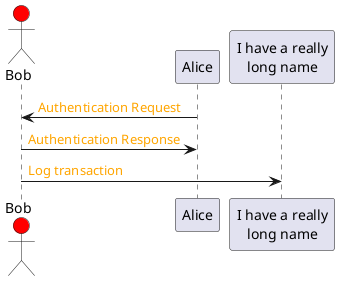

# UML

## Sequence diagram

```plantuml 
@startuml
actor Bob #red
' The only difference between actor
'and participant is the drawing
participant Alice 
participant "I have a really\nlong name" as L 
/' You can also declare:
   participant L as "I have a really\nlong name"  
  '/

Alice->Bob: <color:orange>Authentication Request</color>         
Bob->Alice: <color:orange>Authentication Response</color>
Bob->L: <color:orange>Log transaction</color>
@enduml
```
<figcaption>Figure 1. UML diagram example</figcaption>

<figure markdown>
  { width="300" }
  <figcaption>Image caption</figcaption>
</figure>

++ctrl++

