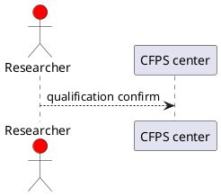
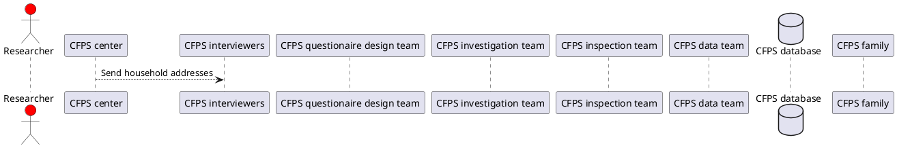

# UML

## Sequence diagram
Sequence diagram is used to describe how a event occurs over time. Usually it start with a request by a user. The request will boost up a series of interactions between players that could be a person, organization, system or any entity. In the UML syntax, these users or players are called as actors or objects. Specifically, an actor is a representation of men-like entity such as a user or an organization while an object represents a thing-like entity such as a book or a machine. In a sequence diagram, each acter or object has a lifeline, which like that a person or product has a life cycle. Technically, an actor is represented with a shape of man, an object is with a shape of rectangle, and a lifeline is with a vertical dashed line as shown below.

=== "Rendered diagram"

    <div class="sequence diagram" align="center" markdown>
    ```plantuml
    @startuml
    actor Researcher #red
    participant "CFPS center"
    @enduml
    ```
    <figcaption>An actor Researcher and a object CFPS center with their lifelines</figcaption>
    </div>

=== "Source code"

    ````markdown
    <div class="sequence diagram" align="center" markdown> (1)
    { .annotate }

    1.  :woman_raising_hand: I'm an annotation as well!
    ```plantuml
    @startuml
    actor Researcher #red
    participant "CFPS center"
    @enduml
    ```
    <figcaption>An actor Researcher and a object CFPS center with their lifelines</figcaption>
    </div>
    ````


<div class="sequence diagram" align="center" markdown>

<figcaption>An actor Bob and a object Box with their lifelines</figcaption>
</div>


<div class="plantuml" align="center"  markdown>


<figcaption>CFPS </figcaption>
</div>


